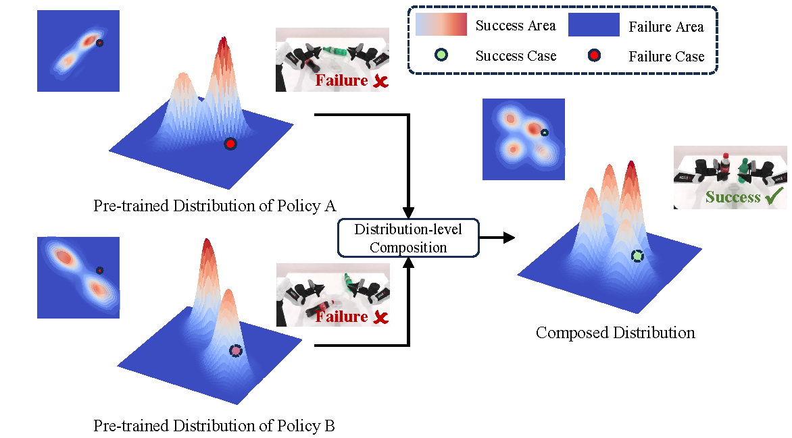
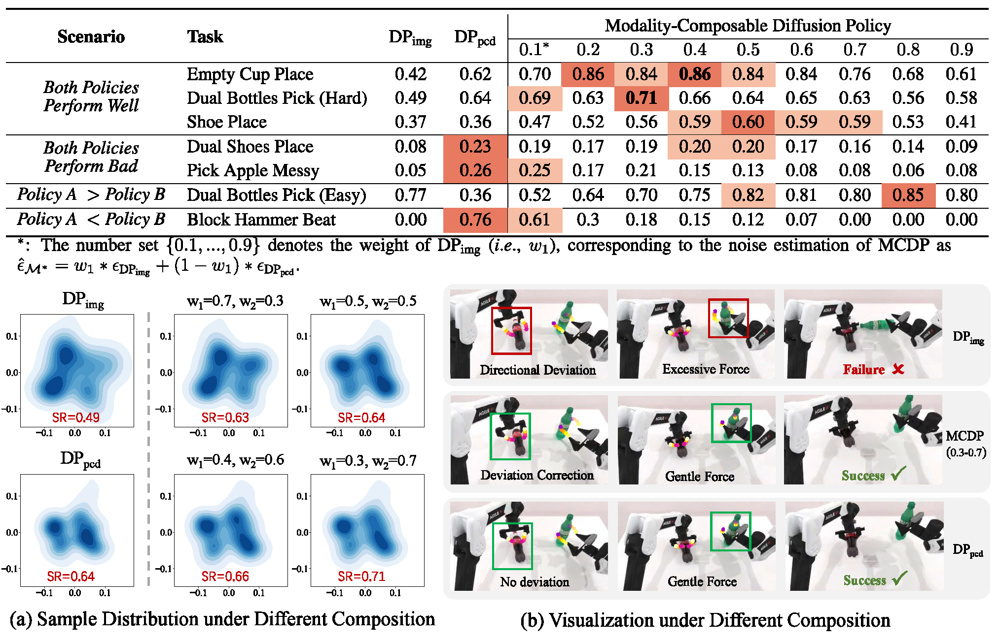

<h1 align="center">
	Modality-Composable Diffusion Policy via Inference-Time Distribution-level Composition<br>
</h1>

Accepted to <i style="color: black; display: inline;"><b>Generative Models for Robot Learning Workshop @ ICLR 2025</b></i>

[PDF](https://github.com/AndyCao1125/MCDP) | [arXiv](https://github.com/AndyCao1125/MCDP)<br>

Jiahang Cao, Qiang Zhang, Hanzhong Guo, Jiaxu Wang, Hao Cheng, Renjing Xu.

*HKUSTGZ, Beijing Innovation Center of Humanoid Robotics, HKU*

<div align="center">
  
</div>

We propose a novel policy composition method: by leveraging multiple pre-trained DPs based on individual visual modalities, we can combine their distributional scores to form a more expressive Modality-Composable Diffusion Policy (MCDP), without the need for additional training.

---
**Note**: This repository as well as the following guidelines are based on [RoboTwin](https://github.com/TianxingChen/RoboTwin), thanks for the authors' open resoure which greatly contributes to the community.

# 💻 Installation & 📚 Data Preparation

Please carefully follow the guidelines in [RoboTwin](https://github.com/TianxingChen/RoboTwin) for installation and data generation.


# 🧑🏻‍💻 Usage 
## Step 1. Prepare the pre-trained single modality-based diffusion policies
### 1. Task Running and Data Collection
Running the following command will first search for a random seed for the target collection quantity (default is 100), and then replay the seed to collect data.

```
bash run_task.sh ${task_name} ${gpu_id}
```
### 2. Training the diffusion policy as well as the 3D diffusion policy
#### (1) Diffusion Policy
The DP code can be found in `policy/Diffusion-Policy`.

Process Data for DP training:
```
python script/pkl2zarr_dp.py ${task_name} ${head_camera_type} ${expert_data_num}
# As example: python script/pkl2zarr_dp.py dual_bottles_pick_hard L515 100, which indicates preprocessing of 100 dual_bottles_pick_hard task trajectory data using L515 camera.
```

Then, move to `policy/Diffusion-Policy` first, and run the following code to train DP:
```
bash train.sh ${task_name} ${head_camera_type} ${expert_data_num} ${seed} ${gpu_id}
# As example: bash train.sh dual_bottles_pick_hard L515 100 0 0
```

#### (2) 3D Diffusion Policy
The DP3 code can be found in `policy/3D-Diffusion-Policy`.

Process Data for DP3 training:
```
python script/pkl2zarr_dp3.py ${task_name} ${head_camera_type} ${expert_data_num}
# As example: python script/pkl2zarr_dp3.py dual_bottles_pick_hard L515 100
```

Then, move to `policy/3D-Diffusion-Policy` first, and run the following code to train DP3:
```
bash train_ddpm.sh ${task_name} ${head_camera_type} ${expert_data_num} ${seed} ${gpu_id}
# As example: bash train_ddpm.sh dual_bottles_pick_hard L515 100 0 0
```
**Note**: One difference between our training settings and RoboTwin's default settings is that we need to align the distribution space of the action, which means that **DP and DP3's noise scheduler need to be consistent**. Including prediction type, inference time steps and so on. Here we align DP3's noise scheduler with DP's default DDPM scheduler (in principle, as long as both schedulers are consistent, not limited to DDPM) to ensure that the action spaces of the two policies are aligned during inference sampling.

## Step 2. Compose the pre-trained policies via distribution-level composition

Move to `policy/3D-Diffusion-Policy` first, then run the following code to evaluate MCDP for a specific task for 100 times:
```
bash eval_composed.sh ${task_name} ${head_camera_type} ${expert_data_num} ${checkpoint_num} ${seed} ${gpu_id} ${dp_w} ${dp3_w}
# As example: # bash eval_composed.sh dual_bottles_pick_hard L515 100 3000 0 0 0.3 0.7
```


# 🏄‍♂️ Experiment 
## Simulation Results
For each task, we evaluated the baseline performance under L515 (320×180 resolution, FOV 45°) camera.
The DP_img and DP_pcd correspond to the diffusion policy based on RGB images (i.e.,, DP) and point cloud (i.e.,, DP3), respectively. We reproduced the DP and DP3 (without using point cloud color) with random seed 0.



## 🔎 Findings
1. When both DPs have moderate accuracy (both 30%), MCDP often achieves higher accuracy under appropriate weight configurations compared to unimodal DPs.
2. When one DP has significantly lower accuracy, MCDP struggles to surpass the highest accuracy of the better-performing unimodal DP.
3. Building on Finding 1, the improvement of MCDP is maximized when the better-performing unimodal DP holds a larger weight in MCDP.


# 😺 Acknowledgement
Our code is generally built upon: [RoboTwin](https://github.com/TianxingChen/RoboTwin), [3D Diffusion Poliy](https://github.com/YanjieZe/3D-Diffusion-Policy), [Diffusion Policy](https://github.com/real-stanford/diffusion_policy). We thank all these authors for their nicely open sourced code and their great contributions to the community.

# 👍 Citation
TBD

# 🏷️ License
This repository is released under the MIT license. See [LICENSE](./LICENSE) for additional details.


